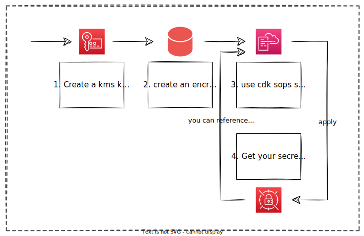

<p/>

&nbsp;
[](https://github.com/markussiebert/cdk-sops-secrets/actions/workflows/release.yml)<br>

[](https://constructs.dev/packages/cdk-sops-secrets)<br>
[](https://www.npmjs.com/package/cdk-sops-secrets)&nbsp;
[](https://www.npmjs.com/package/cdk-sops-secrets)<br>
[](https://pypi.org/project/cdk-sops-secrets)&nbsp;
[](https://pypi.org/project/cdk-sops-secrets)<br>

[](https://codecov.io/gh/markussiebert/cdk-sops-secrets)&nbsp;&nbsp;
[](https://github.com/markussiebert/cdk-sops-secrets/issues?q=is%3Aissue+is%3Aopen+label%3A%22security+vulnerability%22)&nbsp;

# Announcement: Project will move into https://github.com/dbsystel organization

This project will move in the near future into the dbsystel organization.

## Introduction

This construct library provides a replacement for CDK SecretsManager secrets, with extended functionality for Mozilla/sops.

<p/><center></center><p/>
Using this library it is possible to populate Secrets with values from a Mozilla/sops file without additional scripts and steps in the CI stage. Thereby transformations like JSON conversion of YAML files and transformation into a flat, JSONPath like structure will be performed, but can be disabled.

Secrets filled in this way can be used immediately within the CloudFormation stack and dynamic references. This construct should handle all dependencies, if you use the `secretValueFromJson()` or `secretValue()` call to access secret values.

This way, secrets can be securely stored in git repositories and easily synchronized into AWS SecretsManager secrets.

## Stability

You can consider this package as stable. Updates will follow [Semantic Versioning](https://semver.org/).<br>
Nevertheless, I would recommend pinning the exact version of this library in your `package.json`.

## Prerequisites

- [AWS](https://aws.amazon.com/): I think you already knew it, but this construct will only work with an AWS account.

* [KMS Key](https://aws.amazon.com/kms/?nc1=h_ls): It makes most sense to encrypt your secrets with AWS KMS if you want to sync and use the secret content afterwards in your AWS account.
* [mozilla/sops](https://github.com/mozilla/sops): This construct assumes that you store your secrets encrypted via sops in your git repository.
* [CDK](https://aws.amazon.com/cdk/?nc1=h_ls): As this is a CDK construct, it's only useful if you use the CloudDevelopmentToolkit.

## Getting started

1. Create a Mozilla/sops secrets file (encrypted with an already existing KMS key) and place it somewhere in your git repository
2. Create a secret with the SopsSecret construct inside your app
   ```ts
   const secret = new SopsSecret(stack, 'SopsComplexSecretJSON', {
     sopsFilePath: 'secets/sopsfile-encrypted.json',
   });
   ```
3. Optional: Access the secret via dynamic references
   ```ts
   secret.secretValueFromJson('json.path.dotted.notation.accessor[0]').toString(),
   ```

## Advanced configuration examples

Even if using the main functionality should be done in 3 lines of code, there are more options to configure the constructs of this library. If you want to get an Overview of all available configuration options take a look at the [documentation at the CDK ConstructHub](https://constructs.dev/packages/cdk-sops-secrets).

The most useful settings will be explained in the further chapters:

### Getting a specific (older version)

While creating the secret or updating the entries of a secret, the native CDK function ```cdk.FileSystem.fingerprint(...)``` is used to generate the version information of the AWS SecretsManager secret.
Therefore, it is possible to reference the entries from a specific AWS SecretsManager version.

```typescript
const versionId = cdk.FileSystem.fingerprint(`./sops/SomeSecrets.json`)
const passphrase = ecs.Secret.fromSecretsManagerVersion(secretMgmt, { versionId: versionId }, 'MY_PRIVATE_PASSPHRASE')

const container = TaskDef.addContainer('Container', {
   secrets: {
     MY_PRIVATE_PASSPHRASE: passphrase,
   },
});
```

### Default conversions and how to disable them?

As default behavior, the SopsSecret (via the SopsSync) will convert all content to JSON and flatten its structure. This is useful, because the AWS SecretsManager has some limitations if it comes to YAML and/or complex objects and decimal values. Even if you can store YAML, complex objects and even binaries in AWS SecretsManager secrets, you can't access their values via the SecretsManager API — you can only return them as is. So accessing (nested) values or values from YAML files won't be possible via [dynamic references](https://docs.aws.amazon.com/AWSCloudFormation/latest/UserGuide/dynamic-references.html) in CloudFormation (and CDK). That's why I decided that conversion to JSON, flatten the structure and stringify all values should be the default behavior. But you can turn off all of these conversion steps:

```typescript
const secret = new SopsSecret(this, 'SopsComplexSecretJSON', {
  convertToJSON: false, // disable converting the encrypted content to JSON
  stringify: false, // disable stringifying all values
  flatten: false, // disable flattening of the object structure
  sopsFilePath: 'secrets/sopsfile-encrypted.json',
});
```

### Resource provider is missing permissions

Sometimes it can be necessary to access the IAM role of the SopsSync provider. If this is the case, you should create the provider before creating the SopsSecret, and pass the provider to it like this:

```typescript
// Create the provider
const provider = new SopsSyncProvider(this, 'CustomSopsSyncProvider');
// Grant whatever you need to the provider
const myExtraKmsKey = Key.fromKeyArn(this, 'MyExtraKmsKey', 'YourKeyArn');
myExtraKmsKey.grantDecrypt(provider);
// create the secret and pass the the provider to it
const secret = new SopsSecret(this, 'SopsComplexSecretJSON', {
  sopsProvider: provider,
  secretName: 'myCoolSecret',
  sopsFilePath: 'secrets/sopsfile-encrypted.json',
});
```

### UploadType: INLINE / ASSET

I decided, that the default behavior should be "INLINE" because of the following consideration:

- Fewer permissions: If we use inline content instead of a S3 asset, the SopsSyncProvider does not need permissions to access the asset bucket and its KMS key.
- Faster: If we don't have to upload and download things from and to S3, it should be a little faster.
- Interchangeable: As we use the same information to generate the version of the secret, no new version of the secret should be created, if you change from INLINE to ASSET or vice versa, even if the CloudFormation resource updates.
- I personally think sops files are not that big, that we should run into limits, but if so — we can change to asset `uploadType`.

You can change the uplaodType via the properties:

```typescript
const secret = new SopsSecret(this, 'SopsWithAssetUpload', {
  sopsFilePath: 'secrets/sopsfile-encrypted.json',
  uploadType: UploadType.ASSET, // instead of the default UploadType.INLINE
});
```

## FAQ

### It does not work, what can I do?

Even if this construct has some unit and integration tests performed, there can be bugs and issues. As everything is performed by a cloudformation custom resource provider, a good starting point is the log of the corresponding lambda function. It should be located in your AWS Account under Cloudwatch -> Log groups: 

```/aws/lambda/<YOUR-STACK-NAME>-SingletonLambdaSopsSyncProvider<SOMETHINGsomething1234>```

### Error getting data key: 0 successful groups required, got 0

This error message (and failed sync) is related to the  mozilla/sops issues [#948](https://github.com/mozilla/sops/issues/948) and [#634](https://github.com/mozilla/sops/issues/634). You must not create your secret with the ```--aws-profile``` flag. This profile will be written to your sops filed and is required in every runtime environment. You have to define the profile to use via the environment variable ```AWS_PROFILE``` instead, to avoid this.

### Asset of sync lambda not found

The lambda asset code is generated relative to the path of the index.ts in this package. With tools like nx this can lead to wrong results, so that the asset could not be found.

You can override the asset path via the [cdk.json](https://docs.aws.amazon.com/cdk/v2/guide/get_context_var.html) or via the flag ```-c```of the cdk cli.

The context used for this override is ```sops_sync_provider_asset_path```.

So for example you can use 

```bash
cdk deploy -c "sops_sync_provider_asset_path=some/path/asset.zip"
```

or in your cdk.json

```json
{
  "context": {
    "sops_sync_provider_asset_path": "some/path/asset.zip"
  } 
}
```

## Motivation

I have created this project to solve a recurring problem of syncing Mozilla/sops secrets into AWS SecretsManager in a convenient, secure way.

Other than that, or perhaps more importantly, my goal was to learn new things:

- Write a Golang lambda
- Writing unit tests incl. mocks in Golang
- Reproducible builds of Golang binaries (byte-by-byte identical)
- Build reproducible zips (byte-by-byte identical)
- Release a NPM package
- Setting up projects with projen
- CI/CD with GitHub actions
- CDK unit and integration tests

## Other Tools like this

The problem this Construct addresses is so good, already two other implementations exist:

- [isotoma/sops-secretsmanager-cdk](https://github.com/isotoma/sops-secretsmanager-cdk): Does nearly the same. Uses CustomResource, wraps the sops CLI, does not support flatten. Found it after I published my solution to NPM :-/
- [taimos/secretsmanager-versioning](https://github.com/taimos/secretsmanager-versioning): Different approach on the same problem. This is a CLI tool with very nice integration into CDK and also handles git versioning information.

## License

The Apache-2.0 license. Please have a look at the [LICENSE](LICENSE) and [LICENSE-3RD-PARTY](LICENSE-3RD-PARTY).